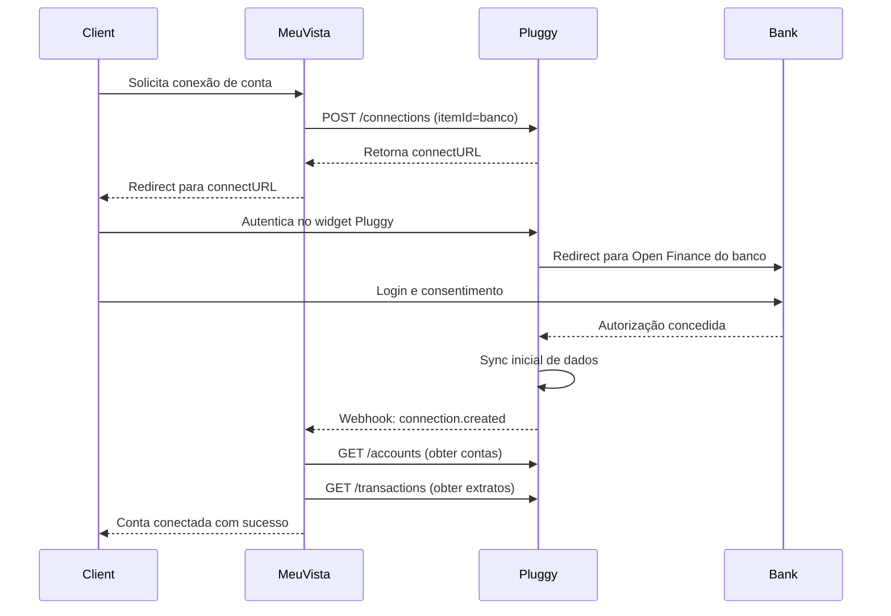

# TECHNICAL ARCHITECTURE - MEU VISTA
## Arquitetura Técnica, Stack Tecnológico e Integra

ções

---

## 1. VISÃO GERAL DA ARQUITETURA

### 1.1 Modelo de Arquitetura

**Tipo:** SaaS (Software as a Service) B2B2C Multi-tenant
**Deployment:** Cloud-based
**Padrão:** Arquitetura de três camadas (three-tier architecture)

```
┌─────────────────────────────────────────────────────────────┐
│                    CAMADA DE APRESENTAÇÃO                   │
│  ┌──────────────┐  ┌──────────────┐  ┌──────────────┐      │
│  │   Web App    │  │  Mobile App  │  │  Admin Panel │      │
│  │  (Planejador)│  │   (Cliente)  │  │ (Vista Gestor)│     │
│  └──────────────┘  └──────────────┘  └──────────────┘      │
└─────────────────────────────────────────────────────────────┘
                            │
                            ▼
┌─────────────────────────────────────────────────────────────┐
│                    CAMADA DE APLICAÇÃO                      │
│  ┌──────────────────────────────────────────────────────┐  │
│  │              API Gateway / Load Balancer             │  │
│  └──────────────────────────────────────────────────────┘  │
│  ┌───────────┐  ┌───────────┐  ┌───────────┐  ┌────────┐  │
│  │ Auth      │  │ User      │  │ Financial │  │ Report │  │
│  │ Service   │  │ Service   │  │ Service   │  │ Service│  │
│  └───────────┘  └───────────┘  └───────────┘  └────────┘  │
│  ┌───────────┐  ┌───────────┐  ┌───────────┐              │
│  │ Sync      │  │ Analytics │  │ Notification │            │
│  │ Service   │  │ Service   │  │ Service   │              │
│  └───────────┘  └───────────┘  └───────────┘              │
└─────────────────────────────────────────────────────────────┘
                            │
                            ▼
┌─────────────────────────────────────────────────────────────┐
│                    CAMADA DE DADOS                          │
│  ┌──────────────┐  ┌──────────────┐  ┌──────────────┐      │
│  │  PostgreSQL  │  │    Redis     │  │   MongoDB    │      │
│  │ (Relacional) │  │   (Cache)    │  │ (Documentos) │      │
│  └──────────────┘  └──────────────┘  └──────────────┘      │
│  ┌──────────────┐  ┌──────────────┐                        │
│  │  S3/Storage  │  │  Queue/Jobs  │                        │
│  │  (Arquivos)  │  │  (Background)│                        │
│  └──────────────┘  └──────────────┘                        │
└─────────────────────────────────────────────────────────────┘
                            │
                            ▼
┌─────────────────────────────────────────────────────────────┐
│                 INTEGRAÇÕES EXTERNAS                        │
│  ┌────────┐  ┌────────┐  ┌────────┐  ┌────────┐  ┌──────┐ │
│  │ Pluggy │  │ Kinvo  │  │   B3   │  │ Banks  │  │Payment││
│  │  API   │  │  API   │  │  CEI   │  │ Direct │  │Gateway││
│  └────────┘  └────────┘  └────────┘  └────────┘  └──────┘ │
└─────────────────────────────────────────────────────────────┘
```

### 1.2 Componentes Principais

1. **Web Application (Planejador):** Interface principal para consultores financeiros
2. **Mobile Application (Cliente):** App nativo iOS/Android para clientes finais
3. **Admin Panel (Vista Gestor):** Dashboard de gestão para escritórios multi-planejador
4. **API Backend:** Serviços RESTful/GraphQL para lógica de negócio
5. **Database Layer:** Persistência de dados estruturados e não-estruturados
6. **Integration Layer:** Conectores para APIs externas
7. **Background Jobs:** Processamento assíncrono (sincronizações, relatórios, notificações)

---

## 2. STACK TECNOLÓGICO

### 2.1 Frontend

#### Web Application (Planejador e Vista Gestor)

**Framework Base:**
- **Provável:** React.js ou Vue.js
- **Alternativa:** Angular (menos provável dado o contexto de startup)

**Evidências do Website:**
- WordPress com Elementor para site institucional
- Plataforma principal (app.meuvista.com) separada - provavelmente SPA (Single Page Application)

**Libraries e Ferramentas (Inferidas):**
- **State Management:** Redux/Zustand (React) ou Vuex/Pinia (Vue)
- **UI Components:** Material-UI, Ant Design, ou biblioteca customizada
- **Charts/Visualizations:** Chart.js, D3.js, Recharts, ApexCharts
- **Form Management:** Formik, React Hook Form, VeeValidate
- **HTTP Client:** Axios ou Fetch API
- **Routing:** React Router ou Vue Router
- **Build Tool:** Webpack, Vite, ou Create React App

**Tecnologias Complementares:**
- **CSS:** Styled-components, CSS Modules, Tailwind CSS, ou SASS
- **TypeScript:** Provavelmente utilizado para type safety
- **PWA:** Possível Progressive Web App para funcionalidades offline

#### Mobile Application (Cliente)

**Opções Prováveis:**

1. **React Native (Mais Provável)**
   - Compartilhamento de código com web
   - Comunidade grande no Brasil
   - Performance adequada para o caso de uso
   - Listado nas stores: iOS e Android

2. **Flutter (Alternativa)**
   - Performance nativa
   - Single codebase
   - Crescente no Brasil

3. **Nativo (Improvável)**
   - Custo alto de manter duas bases (Swift + Kotlin)
   - Startup tenderia a escolher cross-platform

**Features Nativas Utilizadas:**
- Push Notifications (Firebase Cloud Messaging / Apple Push Notification Service)
- Camera (foto de nota fiscal)
- Geolocation (opcional para categorização)
- Biometrics (Face ID, Touch ID para autenticação)
- Deep Linking (abrir app de emails/links)

### 2.2 Backend

#### Linguagem e Framework

**Opção 1: Node.js (Provável - 70%)**
- **Framework:** Express.js, NestJS, ou Fastify
- **Vantagens:**
  - JavaScript full-stack (compartilha com frontend)
  - Ecossistema rico
  - Boa performance para I/O-bound (APIs externas)
  - Comunidade grande no Brasil

**Opção 2: Python (Possível - 20%)**
- **Framework:** Django, FastAPI, Flask
- **Vantagens:**
  - Excelente para data processing e analytics
  - Machine learning integrado (categorização automática)
  - Leitura clara do código

**Opção 3: Ruby on Rails (Possível - 10%)**
- **Vantagens:**
  - Rapidez de desenvolvimento (startup early stage)
  - Convenções estabelecidas
- **Desvantagens:**
  - Comunidade menor atualmente

**Arquitetura de Backend:**
- **Microserviços (Provável):** Serviços independentes para Auth, Users, Financial Data, Reports, Sync
- **Monolito Modular (Alternativa):** Single application bem estruturada em módulos

#### API Design

**Estilo:**
- **RESTful API (Provável):** Endpoints claros /api/v1/users, /api/v1/clients, etc.
- **GraphQL (Possível):** Flexibilidade para queries complexas do frontend

**Autenticação e Autorização:**
- **JWT (JSON Web Tokens):** Para autenticação stateless
- **OAuth 2.0:** Para integrações Open Finance
- **RBAC (Role-Based Access Control):** Permissões por tipo de usuário (Admin, Planejador, Cliente)

**Segurança:**
- HTTPS/TLS obrigatório (SSL mencionado na política de privacidade)
- Rate limiting (proteção contra DDoS)
- CORS configurado corretamente
- Input validation e sanitization
- Proteção contra CSRF, XSS, SQL Injection

### 2.3 Banco de Dados

#### Database Principal

**Opção 1: PostgreSQL (Mais Provável - 80%)**
- **Tipo:** Relacional (RDBMS)
- **Vantagens:**
  - Robusto e confiável
  - ACID compliance (crucial para dados financeiros)
  - JSON support (flexibilidade)
  - Excelente performance
  - Open source e maduro
- **Uso:**
  - Dados de usuários, clientes, transações
  - Patrimônio, investimentos, orçamento
  - Relacionamentos complexos

**Opção 2: MySQL/MariaDB (Alternativa)**
- Similarmente capaz, mas PostgreSQL é preferido para aplicações financeiras complexas

#### Databases Complementares

**Redis (Cache e Sessions - 95% Provável)**
- **Tipo:** In-memory key-value store
- **Uso:**
  - Cache de queries frequentes
  - Session storage
  - Rate limiting
  - Real-time data (dashboard metrics)
  - Queue para background jobs

**MongoDB ou DynamoDB (Possível para Logs/Analytics)**
- **Tipo:** NoSQL Document Store
- **Uso:**
  - Logs de aplicação
  - Analytics events
  - Dados não-estruturados

**S3 ou Cloud Storage (Arquivos)**
- **Uso:**
  - PDFs de relatórios gerados
  - Fotos de notas fiscais
  - Documentos anexados
  - Backups

### 2.4 Infraestrutura e DevOps

#### Cloud Provider

**Opção 1: AWS (Amazon Web Services) - Provável**
- **Serviços Utilizados:**
  - EC2 (servidores) ou ECS/EKS (containers)
  - RDS (PostgreSQL gerenciado)
  - ElastiCache (Redis gerenciado)
  - S3 (storage)
  - CloudFront (CDN)
  - Lambda (functions serverless para tarefas pontuais)
  - SES (envio de emails)
  - CloudWatch (monitoring)

**Opção 2: Google Cloud Platform**
- Alternativa igualmente capaz

**Opção 3: Azure**
- Menos comum para startups brasileiras, mas possível

**Opção 4: DigitalOcean / Heroku (Early Stage)**
- Se startup muito inicial, pode ter começado com plataforma mais simples

#### Containerização

**Docker (Provável - 90%)**
- Containerização de microserviços
- Consistência entre dev/staging/prod
- Facilita deploy e escalabilidade

**Kubernetes (Possível - 40%)**
- Orquestração de containers
- Auto-scaling
- Mais comum se já tiver escala significativa

#### CI/CD

**Pipeline de Deploy:**
- **Git:** GitHub, GitLab, ou Bitbucket
- **CI/CD:** GitHub Actions, GitLab CI, CircleCI, ou Jenkins
- **Stages:** Test → Build → Deploy to Staging → Deploy to Production
- **Testing:** Unit tests, Integration tests, E2E tests

**Ambientes:**
- Development (local)
- Staging (pré-produção)
- Production (clientes reais)

#### Monitoring e Observability

**Application Performance Monitoring (APM):**
- New Relic, Datadog, ou Sentry
- Tracking de erros e performance

**Logging:**
- ELK Stack (Elasticsearch, Logstash, Kibana)
- CloudWatch Logs (se AWS)

**Metrics:**
- Prometheus + Grafana
- CloudWatch Metrics

### 2.5 Ferramentas de Desenvolvimento

**Analytics e Tracking (Confirmado pelo Website):**
- **Google Tag Manager:** Gestão de tags
- **Google Analytics:** Web analytics
- **Facebook Pixel:** Tracking de conversões
- **PixelYourSite:** Integração WordPress

**Marketing Automation:**
- **HubSpot (Confirmado):** CRM e marketing automation
- **RD Station (Confirmado no blog):** Formulários e leads

**Communication:**
- **SendGrid ou AWS SES:** Emails transacionais
- **Twilio ou similar:** SMS (se usado)
- **Firebase Cloud Messaging:** Push notifications

**Payment Processing:**
- **Stripe ou Pagar.me:** Cobrança de assinaturas
- **Boleto e PIX:** Métodos de pagamento brasileiros

---

## 3. INTEGRAÇÕES EXTERNAS

### 3.1 Open Finance / Open Banking

#### Pluggy API (Confirmado)

**Documentação:** https://www.pluggy.ai/

**Funcionalidades Utilizadas:**
- **Accounts:** Conexão com contas correntes, poupança
- **Transactions:** Extrato de transações bancárias
- **Credit Cards:** Faturas e limites de cartões
- **Investments:** Produtos de investimento (limitado comparado a Kinvo)
- **Loans:** Empréstimos e financiamentos

**Fluxo de Integração:**
1. Cliente autoriza conexão via Pluggy Widget
2. Redirect para autenticação no banco (Open Finance)
3. Cliente consente compartilhamento de dados
4. Pluggy retorna token de acesso
5. Meu Vista faz chamadas à Pluggy API com token
6. Dados são sincronizados e armazenados
7. Renovação de consentimento a cada 90 dias (típico)

**Instituições Cobertas:**
- Principais bancos brasileiros (Itaú, Bradesco, Santander, Banco do Brasil, Caixa)
- Bancos digitais (Nubank, Inter, C6, Next, Neon)
- Corretoras selecionadas
- Cooperativas de crédito

**Modelo de Pricing (Típico para Pluggy):**
- Cobrança por API call ou por conexão ativa
- Custo variável baseado em volume de uso

**Desafios Técnicos:**
- **Instabilidade:** Bancos podem ficar offline ou mudar APIs
- **Consentimentos Expirados:** Necessidade de re-autenticação periódica
- **Rate Limits:** Limites de chamadas por minuto
- **Latência:** Algumas queries podem demorar (bancos respondendo lentamente)

### 3.2 Consolidação de Investimentos

#### Kinvo API (Confirmado na Política de Privacidade)

**Documentação:** Kinvo oferece API para consolidadores profissionais

**Funcionalidades:**
- **Consolidação de Ativos:**
  - Ações (B3)
  - Fundos de investimento
  - Tesouro Direto
  - Renda fixa (CDB, LCI, LCA, Debêntures)
  - FIIs (Fundos Imobiliários)
  - ETFs e BDRs
  - Criptomoedas (exchanges integradas)

- **Dados Fornecidos:**
  - Posição atualizada de cada ativo
  - Cotação em tempo real
  - Rentabilidade histórica
  - Proventos (dividendos, JCP, aluguéis)
  - Custos e taxas (corretagem, custódia)

**Fluxo de Integração:**
1. Cliente conecta corretoras/exchanges no Kinvo (ou diretamente via Meu Vista)
2. Kinvo agrega dados de múltiplas fontes
3. Meu Vista consome Kinvo API para obter posição consolidada
4. Sincronização noturna automática + manual sob demanda

**Fontes de Dados do Kinvo:**
- CEI (B3) para custódia de ações e FIIs
- Integração direta com corretoras (XP, Órama, BTG em beta)
- Tesouro Direto
- Exchanges de cripto (Mercado Bitcoin, Foxbit, Bitcoin Trade)

**Modelo de Pricing:**
- Provavelmente licensing fee + custo por usuário ou API call
- Kinvo oferece planos B2B para consolidadores

#### Alternativas ou Complementos

**Gorila (GorilaCORE API)**
- **Uso Potencial:** Consolidação avançada de investimentos
- **Diferencial:** Processamento de milhões de portfolios com alta performance
- **Integração:** API RESTful para cálculo de rentabilidade, alocação, reconciliação
- **Dados:** Histórico de 30 anos de mercado brasileiro

**Comdinheiro API**
- **Uso Potencial:** Consolidação de portfolios onshore e offshore
- **Diferencial:** Suporte a múltiplas moedas, ativos internacionais
- **Target:** Mais voltado para wealth managers e grandes portfolios

**Nota:** Meu Vista pode usar apenas Kinvo ou combinar múltiplas fontes dependendo da necessidade

### 3.3 Bolsa de Valores (B3)

#### CEI (Canal Eletrônico do Investidor)

**Descrição:** Sistema da B3 para consulta de custódia de ativos

**Acesso:**
- Via credenciais do investidor no site da B3
- Integração via API (através de agregadores como Kinvo, Pluggy)

**Dados Obtidos:**
- Posição de ações
- Fundos imobiliários (FIIs)
- ETFs e BDRs
- Histórico de movimentações

**Limitações:**
- Não inclui renda fixa privada (CDBs, LCIs) diretamente
- Dados de D+1 ou D+2 (não real-time)

### 3.4 Instituições Financeiras (Integrações Diretas)

**Corretoras com Integração Direta (Mencionadas):**
- **XP Investimentos:** Parceria estratégica, possível API direta
- **BTG Pactual:** Idem
- **Órama:** Em beta (via Kinvo)

**Bancos:**
- Via Pluggy/Open Finance (não direto)

**Benefícios de Integrações Diretas:**
- Dados mais completos e atualizados
- Menor latência
- Maior confiabilidade
- Possível acesso a produtos exclusivos

### 3.5 Serviços de Terceiros

#### HubSpot (Confirmado)

**Uso:**
- CRM para gestão de leads
- Marketing automation (emails, workflows)
- Tracking de interações no site
- Funil de vendas

**Integração:**
- JavaScript SDK no website
- API para sincronização de dados

#### Google Services

**Google Tag Manager (Confirmado):**
- Gestão centralizada de scripts de tracking

**Google Analytics (Confirmado):**
- Web analytics
- Funil de conversão
- Comportamento de usuários

#### Facebook/Meta (Confirmado)

**Facebook Pixel:**
- Tracking de eventos
- Retargeting
- Lookalike audiences

#### Payment Gateway

**Opções Prováveis:**
- **Stripe:** Internacional, bem documentado, suporte a assinaturas recorrentes
- **Pagar.me (Stone):** Nacional, suporte a Boleto e PIX
- **Vindi/Iugu:** Especializados em billing recorrente

**Métodos de Pagamento:**
- Cartão de crédito (nacional e internacional)
- Boleto bancário
- PIX
- Possível: Débito automático

#### Notificações

**Push Notifications (Mobile):**
- Firebase Cloud Messaging (Android)
- Apple Push Notification Service (iOS)

**Email:**
- SendGrid, Mailgun, AWS SES, ou similar

**SMS (Opcional):**
- Twilio, Nexmo, ou provedor brasileiro

#### Armazenamento de Arquivos

**S3 (AWS) ou Equivalente:**
- PDFs de diagnóstico e relatórios
- Fotos de notas fiscais (upload de clientes)
- Documentos anexados
- Backups de banco de dados

### 3.6 Vista Finance (Produto Próprio Integrado)

**Arquitetura:**
- Módulo separado mas integrado ao sistema principal
- Possível microserviço dedicado

**Integrações com Instituições Financeiras:**
- **Consórcios:** Administradoras parceiras (não especificadas publicamente)
- **Home Equity:** Bancos oferecendo crédito com garantia
- **Financiamentos:** Bancos e financeiras

**Fluxo de Dados:**
1. Planejador preenche proposta no Vista Finance
2. Dados são enviados via API para instituições parceiras
3. Instituições analisam e retornam proposta
4. Cliente assina digitalmente
5. Contrato é efetivado
6. Instituição notifica Meu Vista de conclusão
7. Comissão é registrada e paga ao planejador

**Compliance:**
- Integração com sistemas de compliance das instituições
- KYC (Know Your Customer)
- Análise de crédito

---

## 4. MODELO DE DADOS

### 4.1 Entidades Principais

#### Users (Usuários - Planejadores)
```
Users
├── id (UUID)
├── email (unique, encrypted)
├── password_hash
├── name
├── cpf (encrypted)
├── phone
├── created_at
├── plan_type (ignition, business, escalada)
├── subscription_status (active, inactive, trial, cancelled)
├── company_id (FK para Companies, se Vista Gestor)
├── role (admin, planner, assistant)
├── certifications (CPA, CFP, etc.)
└── settings (JSON - preferências)
```

#### Companies (Escritórios - Vista Gestor)
```
Companies
├── id (UUID)
├── name
├── cnpj (encrypted)
├── white_label_enabled (boolean)
├── logo_url
├── brand_colors (JSON)
├── custom_domain
├── created_at
└── subscription_tier
```

#### Clients (Clientes Finais)
```
Clients
├── id (UUID)
├── planner_id (FK para Users)
├── name
├── cpf (encrypted)
├── email (encrypted)
├── phone (encrypted)
├── birth_date
├── marital_status
├── dependents (JSON array)
├── occupation
├── monthly_income
├── risk_profile (conservative, moderate, aggressive)
├── financial_literacy_level
├── created_at
├── status (active, inactive, prospect)
└── app_credentials (para login no app mobile)
```

#### Accounts (Contas Bancárias e Investimentos)
```
Accounts
├── id (UUID)
├── client_id (FK)
├── institution_name
├── institution_code
├── account_type (checking, savings, investment, credit_card)
├── connection_id (Pluggy/Kinvo ID)
├── last_sync_at
├── sync_status (synced, error, pending)
├── balance
├── currency (BRL, USD, etc.)
└── consent_expires_at
```

#### Transactions (Transações)
```
Transactions
├── id (UUID)
├── account_id (FK)
├── client_id (FK)
├── date
├── description
├── amount
├── type (debit, credit)
├── category_id (FK para Categories)
├── subcategory_id (FK)
├── status (pending, cleared)
├── is_recurring (boolean)
├── notes
└── receipt_url (foto de nota fiscal)
```

#### Categories (Categorias de Orçamento)
```
Categories
├── id (UUID)
├── name
├── type (income, expense)
├── parent_id (FK self-reference para subcategorias)
├── icon
├── color
└── is_default (boolean - categoria padrão vs customizada)
```

#### Budget (Orçamento)
```
Budget
├── id (UUID)
├── client_id (FK)
├── category_id (FK)
├── period (month/year)
├── planned_amount
├── actual_amount (calculado dinamicamente ou cached)
└── variance
```

#### Assets (Ativos Patrimoniais)
```
Assets
├── id (UUID)
├── client_id (FK)
├── asset_type (real_estate, vehicle, company_stake, other)
├── description
├── current_value
├── acquisition_date
├── acquisition_value
├── acquisition_method (cash, financed, inheritance, gift)
├── is_financed (boolean)
├── debt_balance (se financiado)
├── photos (JSON array de URLs)
└── documents (JSON array de URLs)
```

#### Investments (Investimentos)
```
Investments
├── id (UUID)
├── client_id (FK)
├── account_id (FK)
├── investment_type (stocks, funds, fixed_income, crypto, etc.)
├── ticker_code
├── institution
├── quantity
├── average_price
├── current_price (atualizado via Kinvo)
├── total_invested
├── current_value
├── profitability_percent
├── profitability_amount
├── last_updated_at
└── linked_goal_id (FK para Goals)
```

#### Debts (Dívidas)
```
Debts
├── id (UUID)
├── client_id (FK)
├── debt_type (credit_card, personal_loan, mortgage, auto_loan, other)
├── institution
├── total_balance
├── interest_rate (monthly or annual)
├── installment_amount
├── due_date
├── remaining_installments
├── collateral (se houver garantia)
└── status (active, paid_off)
```

#### Goals (Sonhos/Metas)
```
Goals
├── id (UUID)
├── client_id (FK)
├── name
├── description
├── target_amount
├── deadline (data desejada)
├── current_amount (calculado de investimentos vinculados)
├── priority (high, medium, low)
├── category (home, travel, retirement, education, etc.)
├── image_url
└── status (in_progress, achieved, abandoned)
```

#### Reports (Relatórios)
```
Reports
├── id (UUID)
├── client_id (FK)
├── planner_id (FK)
├── report_type (diagnosis, budget, portfolio, comprehensive)
├── generated_at
├── period_start
├── period_end
├── pdf_url
└── status (draft, sent, viewed)
```

#### Meetings (Reuniões)
```
Meetings
├── id (UUID)
├── client_id (FK)
├── planner_id (FK)
├── scheduled_at
├── duration_minutes
├── status (scheduled, completed, cancelled)
├── agenda (text)
├── notes (text - ata)
├── decisions (JSON array)
└── next_meeting_at
```

#### Messages (Comunicação)
```
Messages
├── id (UUID)
├── sender_id (User ou Client)
├── recipient_id (User ou Client)
├── client_id (FK - contexto)
├── message_text
├── sent_at
├── read_at
└── attachments (JSON array de URLs)
```

#### VistaFinance_Proposals (Vista Finance)
```
VistaFinance_Proposals
├── id (UUID)
├── client_id (FK)
├── planner_id (FK)
├── product_type (consortium, home_equity, mortgage, auto_loan, personal_loan)
├── requested_amount
├── term_months
├── institution_name
├── interest_rate
├── installment_amount
├── status (pending, approved, rejected, completed)
├── commission_amount
├── commission_paid (boolean)
└── created_at
```

### 4.2 Relacionamentos

**Um-para-Muitos:**
- User (Planejador) → Clients (Clientes)
- Client → Accounts
- Client → Transactions
- Client → Assets
- Client → Investments
- Client → Debts
- Client → Goals
- Client → Reports

**Muitos-para-Muitos:**
- Investments ↔ Goals (investimento pode financiar múltiplos sonhos, sonho pode ter múltiplos investimentos)
- Implementado via tabela junction: InvestmentGoalLinks

**Um-para-Um:**
- Client ↔ AppCredentials (para login mobile)

**Hierarquia:**
- Company (Escritório) → Users (Planejadores) → Clients (Clientes)

### 4.3 Estratégia de Armazenamento

**Dados Sensíveis (Encrypted at Rest):**
- CPF, email, phone, endereço
- Dados financeiros detalhados
- Credenciais de contas externas (tokenizadas)

**Dados Cached (Redis):**
- Saldos de contas (TTL curto)
- Cotações de investimentos (TTL 5-15 minutos)
- Dashboard metrics do planejador

**Dados Arquivados (Cold Storage):**
- Relatórios antigos (> 1 ano)
- Transações históricas (> 5 anos)
- Logs de aplicação (> 6 meses)

**Backup Strategy:**
- Daily automated backups
- Point-in-time recovery (PITR) habilitado
- Geo-redundancy (múltiplas regiões)
- Retention: 30 dias hot, 1 ano cold

---

## 5. SEGURANÇA E COMPLIANCE

### 5.1 Autenticação e Autorização

**Multi-Factor Authentication (MFA):**
- Opcional mas recomendado para planejadores
- Via SMS, email, ou app authenticator
- Obrigatório para ações sensíveis (ex: alterar dados bancários)

**Session Management:**
- JWT com expiração curta (15-30 minutos)
- Refresh tokens com expiração longa (7-30 dias)
- Revogação de tokens em logout

**Password Policy:**
- Mínimo 8 caracteres
- Complexidade (letras, números, símbolos)
- Hash via bcrypt ou Argon2
- Proteção contra brute-force (rate limiting)

**OAuth 2.0:**
- Para integrações Open Finance
- PKCE (Proof Key for Code Exchange) para segurança adicional

### 5.2 Proteção de Dados

**Criptografia:**
- **Em Trânsito:** TLS 1.2+ obrigatório (SSL mencionado na política)
- **Em Repouso:** AES-256 para dados sensíveis
- **Tokenização:** Credenciais de APIs externas nunca em plain text

**LGPD (Lei Geral de Proteção de Dados) Compliance:**
- **Base Legal:** Consentimento + Execução de contrato + Legítimo interesse
- **Direitos do Titular:**
  - Acesso aos dados
  - Correção
  - Exclusão (direito ao esquecimento)
  - Portabilidade
- **DPO (Data Protection Officer):** Designado (obrigatório para tratamento em larga escala)
- **Retenção:** 5 anos pós-término de relacionamento (mínimo legal)

**GDPR (para usuários EU):**
- Conformidade para brasileiros residentes na União Europeia

**PCI DSS (Se processar cartões diretamente):**
- Mais provável que use gateway (Stripe/Pagar.me) que é PCI compliant
- Meu Vista não armazena dados de cartão (tokenização via gateway)

### 5.3 Segurança de Aplicação

**OWASP Top 10 Mitigations:**
1. **Injection:** Prepared statements, ORM, input validation
2. **Broken Authentication:** MFA, secure session management
3. **Sensitive Data Exposure:** Encryption, HTTPS
4. **XML External Entities:** Disable XML parsing (se não usado)
5. **Broken Access Control:** RBAC rigoroso, testes de autorização
6. **Security Misconfiguration:** Hardening de servers, remove defaults
7. **XSS:** Content Security Policy, output encoding
8. **Insecure Deserialization:** Validação de inputs, evitar deserialização de dados não-confiáveis
9. **Using Components with Known Vulnerabilities:** Dependency scanning, updates regulares
10. **Insufficient Logging & Monitoring:** Logging abrangente, alertas

**Penetration Testing:**
- Testes regulares (anuais ou semestrais)
- Bug bounty program (possível)

**Vulnerability Scanning:**
- Ferramentas: Snyk, Dependabot, OWASP Dependency-Check
- CI/CD integrado

### 5.4 Compliance Financeiro

**CVM Instrução 593 (Planejamento Financeiro):**
- Plataforma auxilia planejadores a seguirem normas
- Não substitui responsabilidade profissional
- Materiais de apoio para compliance

**ANBIMA:**
- Código de regulação e melhores práticas
- Educação continuada

**Prevenção à Lavagem de Dinheiro (PLD):**
- KYC (Know Your Customer) básico
- Se Vista Finance processar valores altos, pode precisar de compliance mais robusto

---

## 6. PERFORMANCE E ESCALABILIDADE

### 6.1 Estratégias de Performance

**Caching:**
- **Redis:** Cache de queries frequentes, sessões, rate limiting
- **CDN:** CloudFront ou similar para assets estáticos
- **Browser Caching:** Headers apropriados para JS/CSS/imagens

**Database Optimization:**
- **Indexing:** Índices em campos frequentemente consultados (client_id, date, etc.)
- **Query Optimization:** Evitar N+1 queries, usar JOINs eficientes
- **Connection Pooling:** Reutilização de conexões ao DB
- **Read Replicas:** Separar leitura de escrita para queries pesadas

**Async Processing:**
- **Background Jobs:** Queue (Redis, RabbitMQ, AWS SQS) para:
  - Sincronização de contas (pode demorar minutos)
  - Geração de relatórios (processamento pesado)
  - Envio de emails/notificações em massa
  - Cálculos complexos de investimentos

**Frontend Optimization:**
- **Code Splitting:** Carregar apenas JS necessário para cada página
- **Lazy Loading:** Imagens e componentes carregados sob demanda
- **Minification e Compression:** Gzip/Brotli para assets
- **Image Optimization:** WebP, thumbnails, responsive images

### 6.2 Escalabilidade Horizontal

**Load Balancing:**
- Distribuição de tráfego entre múltiplas instâncias de servidores
- AWS ELB, Nginx, HAProxy

**Stateless Applications:**
- Servidores sem estado (sessões em Redis, não em memória local)
- Facilita scaling horizontal (adicionar/remover servidores dinamicamente)

**Microserviços:**
- Serviços independentes podem escalar individualmente
- Ex: Serviço de sincronização pode ter mais instâncias durante picos

**Database Sharding (Futuro):**
- Particionamento de dados por cliente ou planejador
- Necessário apenas em escala muito grande (100k+ clientes)

### 6.3 Monitoramento de Performance

**Métricas-Chave (KPIs Técnicos):**
- **Uptime:** 99.5%+ (objetivo: 99.9%)
- **Response Time:** API < 200ms (p95), < 500ms (p99)
- **Throughput:** Requests per second suportados
- **Error Rate:** < 0.1%

**Alertas:**
- CPU/Memory > 80% por 5 minutos
- Erro rate > 1% por 1 minuto
- API response time > 1s
- Database connection pool esgotado

**Tools:**
- APM: New Relic, Datadog, Dynatrace
- Logging: ELK Stack, Splunk, CloudWatch
- Metrics: Prometheus + Grafana

---

## 7. INTEGRAÇÕES: DETALHAMENTO TÉCNICO

### 7.1 Open Finance via Pluggy

**Endpoints Principais (Pluggy API):**

```
POST /connect/token
→ Obter token de autenticação

GET /connections
→ Listar conexões de um usuário

POST /connections
→ Criar nova conexão (iniciar flow OAuth)

GET /connections/{id}/accounts
→ Obter contas de uma conexão

GET /accounts/{id}/transactions
→ Obter transações de uma conta

GET /accounts/{id}/investments
→ Obter investimentos (limitado)

GET /connections/{id}/credit-cards
→ Obter cartões de crédito

POST /connections/{id}/refresh
→ Forçar sincronização
```

**Fluxo de Conexão:**



**Webhooks Pluggy:**
- `connection.created`: Nova conexão estabelecida
- `connection.updated`: Sincronização completada
- `connection.error`: Erro na sincronização (senha alterada, banco offline)

**Tratamento de Erros:**
- `INVALID_CREDENTIALS`: Solicitar reautenticação do usuário
- `CONNECTION_TIMEOUT`: Retry automático após X minutos
- `INSTITUTION_UNAVAILABLE`: Informar usuário, tentar mais tarde
- `CONSENT_EXPIRED`: Solicitar renovação de consentimento

**Rate Limits (Típico):**
- 10 requests/second por API key
- 1000 connections simultâneas processando

**Custo Estimado (Referência de Mercado):**
- R$ 0,10 - R$ 0,50 por sincronização bem-sucedida
- Planos por volume com desconto

### 7.2 Consolidação via Kinvo API

**Endpoints Principais (Inferido):**

```
GET /api/v1/portfolios/{portfolioId}
→ Obter portfolio consolidado

GET /api/v1/portfolios/{portfolioId}/positions
→ Posições atuais de todos os ativos

GET /api/v1/portfolios/{portfolioId}/transactions
→ Histórico de transações

GET /api/v1/assets/{assetId}/quote
→ Cotação atual de um ativo

GET /api/v1/portfolios/{portfolioId}/performance
→ Rentabilidade e performance

POST /api/v1/portfolios/{portfolioId}/sync
→ Forçar sincronização
```

**Dados Retornados (Exemplo - Posição de Ação):**

```json
{
  "assetId": "PETR4",
  "assetType": "stock",
  "ticker": "PETR4",
  "name": "Petrobras PN",
  "quantity": 100,
  "averagePrice": 28.50,
  "currentPrice": 32.15,
  "totalInvested": 2850.00,
  "currentValue": 3215.00,
  "profitability": {
    "amount": 365.00,
    "percent": 12.81
  },
  "lastUpdated": "2025-11-04T10:30:00Z"
}
```

**Sincronização:**
- **Automática:** Noturna (via cron job às 2am)
- **Manual:** Cliente ou planejador clica "Sincronizar"
- **Webhook:** Kinvo notifica quando dados são atualizados (se suportado)

**Mapeamento de Ativos:**
- Kinvo usa tickers padrão (PETR4, VALE3, etc.)
- Fundos de investimento: CNPJ único
- Tesouro Direto: códigos padronizados

### 7.3 CEI (B3)

**Acesso:**
- Via API de agregadores (Kinvo, Pluggy)
- Ou scraping de interface web (menos confiável)

**Dados:**
- Custódia de ações, FIIs, ETFs, BDRs
- Movimentações (compra, venda, bonificação, grupamento, desdobramento)

**Limitações:**
- Dados de D+1 ou D+2 (não real-time)
- Não inclui renda fixa privada

### 7.4 Vista Finance - Instituições Parceiras

**Arquitetura de Integração:**

```
Meu Vista Backend
     │
     ▼
Vista Finance Service (Microserviço)
     │
     ├──► Instituição A API (Consórcio)
     ├──► Instituição B API (Home Equity)
     ├──► Instituição C API (Financiamento)
     └──► Instituição D API (Empréstimo)
```

**Fluxo de Proposta:**

1. **Simulação:**
   - Planejador preenche formulário
   - Vista Finance calcula proposta (taxas, prazo, parcela)
   - Pode consultar múltiplas instituições simultaneamente

2. **Envio de Proposta:**
   - Dados do cliente são enviados via API para instituição
   - KYC e documentação anexada

3. **Análise de Crédito:**
   - Instituição analisa (pode levar horas ou dias)
   - Webhook notifica Meu Vista de status updates

4. **Aprovação:**
   - Cliente recebe notificação no app
   - Assinatura digital do contrato

5. **Efetivação:**
   - Instituição libera recursos
   - Comissão é registrada para planejador

**Compliance:**
- Cada instituição tem requisitos específicos
- Documentação obrigatória: RG, CPF, comprovante de renda, endereço
- Para home equity: escritura do imóvel, avaliação

---

## 8. ARQUITETURA DE MICROSERVIÇOS (DETALHADA)

### 8.1 Serviços Principais

#### Auth Service
**Responsabilidade:** Autenticação e autorização
**Endpoints:**
- POST /auth/register
- POST /auth/login
- POST /auth/refresh-token
- POST /auth/logout
- POST /auth/forgot-password
- POST /auth/reset-password

**Tecnologias:**
- JWT generation e validation
- bcrypt para password hashing
- Redis para token blacklist

#### User Service
**Responsabilidade:** Gestão de usuários e perfis
**Endpoints:**
- GET /users/{id}
- PUT /users/{id}
- GET /users/{id}/clients
- GET /users/{id}/subscription

**Database:** PostgreSQL

#### Client Service
**Responsabilidade:** Gestão de clientes finais
**Endpoints:**
- POST /clients
- GET /clients/{id}
- PUT /clients/{id}
- GET /clients/{id}/financial-profile

**Database:** PostgreSQL

#### Account Service
**Responsabilidade:** Gestão de contas bancárias e conexões
**Endpoints:**
- POST /accounts/connect (inicia flow Pluggy)
- GET /accounts/{id}
- POST /accounts/{id}/sync
- DELETE /accounts/{id}/disconnect

**Integrações:** Pluggy API

#### Transaction Service
**Responsabilidade:** Transações e extratos
**Endpoints:**
- GET /transactions (com filtros)
- POST /transactions (manual)
- PUT /transactions/{id}/categorize

**Database:** PostgreSQL (particionado por data para performance)

#### Budget Service
**Responsabilidade:** Orçamento e planejamento
**Endpoints:**
- POST /budgets
- GET /budgets/{clientId}/{period}
- PUT /budgets/{id}
- GET /budgets/{id}/variance

**Database:** PostgreSQL

#### Investment Service
**Responsabilidade:** Gestão de investimentos
**Endpoints:**
- GET /investments/{clientId}
- POST /investments/{id}/sync (Kinvo)
- GET /investments/{id}/performance

**Integrações:** Kinvo API, CEI
**Database:** PostgreSQL + Redis (cache de cotações)

#### Goal Service
**Responsabilidade:** Sonhos e metas
**Endpoints:**
- POST /goals
- GET /goals/{clientId}
- PUT /goals/{id}
- GET /goals/{id}/progress

**Database:** PostgreSQL

#### Report Service
**Responsabilidade:** Geração de relatórios e diagnósticos
**Endpoints:**
- POST /reports/generate
- GET /reports/{id}
- GET /reports/{id}/pdf

**Tecnologias:**
- PDF generation: Puppeteer (headless Chrome) ou pdfkit
- Template engine: Handlebars, EJS
- Background job queue (geração pode demorar)

**Storage:** S3 para PDFs gerados

#### Notification Service
**Responsabilidade:** Envio de notificações
**Endpoints:**
- POST /notifications/send
- POST /notifications/push
- POST /notifications/email

**Integrações:**
- Firebase CM (push)
- SendGrid/AWS SES (email)
- Twilio (SMS)

**Database:** PostgreSQL (log de notificações enviadas)

#### Analytics Service
**Responsabilidade:** Métricas e analytics
**Endpoints:**
- POST /events (tracking)
- GET /analytics/dashboard/{userId}

**Database:** MongoDB ou ClickHouse (otimizado para analytics)

#### Vista Finance Service
**Responsabilidade:** Marketplace de produtos financeiros
**Endpoints:**
- POST /vista-finance/proposals
- GET /vista-finance/proposals/{id}
- GET /vista-finance/institutions
- POST /vista-finance/simulate

**Integrações:** APIs de instituições parceiras

### 8.2 Comunicação Entre Serviços

**Padrão:** RESTful via HTTP/HTTPS
**Alternativa:** gRPC para comunicação interna (mais performática)

**Service Mesh (Futuro):**
- Istio ou Linkerd para gerenciar comunicação
- Service discovery automático
- Load balancing interno

**Event-Driven (Parcial):**
- Eventos críticos podem usar message queue (RabbitMQ, Kafka)
- Ex: `client.created` → dispara criação de orçamento padrão

### 8.3 API Gateway

**Responsabilidade:**
- Ponto de entrada único para todas as requisições
- Roteamento para serviços corretos
- Autenticação e autorização centralizada
- Rate limiting
- Request/response transformation
- Logging e monitoring

**Tecnologias:**
- Kong, AWS API Gateway, Nginx, Traefik

**Exemplo de Rota:**
```
GET /api/v1/clients/123/transactions
↓ (API Gateway)
→ Auth Service (validar JWT)
→ Client Service (verificar permissão)
→ Transaction Service (obter dados)
← Resposta agregada
```

---

## 9. DEPLOYMENT E CI/CD

### 9.1 Ambientes

**Development:**
- Local (docker-compose para todos os serviços)
- Dados mockados ou seed data

**Staging:**
- Réplica de produção
- Dados anonimizados de produção
- Testes finais antes de deploy

**Production:**
- Dados reais
- Alta disponibilidade
- Geo-redundância

### 9.2 Pipeline CI/CD

```
Git Push
  ↓
Trigger CI (GitHub Actions / GitLab CI)
  ↓
Run Tests
  ├── Unit Tests
  ├── Integration Tests
  └── E2E Tests
  ↓
Build Docker Images
  ↓
Push to Container Registry (ECR / Docker Hub)
  ↓
Deploy to Staging
  ↓
Smoke Tests
  ↓
Manual Approval (ou automático)
  ↓
Deploy to Production (Blue-Green ou Canary)
  ↓
Monitor
```

**Deploy Strategies:**
- **Blue-Green:** Dois ambientes, switch instantâneo
- **Canary:** Deploy gradual (5% → 25% → 50% → 100%)
- **Rolling Update:** Atualizar instâncias uma por vez

### 9.3 Rollback Strategy

**Automated:**
- Se error rate > 5% após deploy → rollback automático

**Manual:**
- Botão de rollback no dashboard de deploy
- Reverte para versão anterior em minutos

---

## 10. DESAFIOS TÉCNICOS E SOLUÇÕES

### 10.1 Sincronização de Dados Externos

**Desafio:**
- APIs externas (bancos, Kinvo) podem ser lentas ou instáveis
- Sincronização pode demorar minutos
- Usuário não pode ficar esperando

**Solução:**
- **Background Jobs:** Sincronização assíncrona via queue
- **Webhooks:** Receber notificação quando sync completa
- **Status Tracking:** Interface mostra "Sincronizando..." com progress bar
- **Retry Logic:** Exponential backoff para retentativas
- **Timeout Handling:** Se demorar > 5 minutos, notificar usuário

### 10.2 Consistência de Dados

**Desafio:**
- Múltiplas fontes de dados (Pluggy, Kinvo, manual)
- Possibilidade de duplicatas ou conflitos

**Solução:**
- **Deduplicação:** Algoritmos para identificar transações duplicadas
- **Merge Logic:** Priorizar fonte mais confiável (Open Finance > manual)
- **Reconciliação:** Job noturno para verificar consistência
- **Audit Log:** Rastrear origem de cada dado

### 10.3 Performance em Escala

**Desafio:**
- Milhares de planejadores sincronizando contas simultaneamente
- Geração de relatórios pesada (queries complexas)

**Solução:**
- **Caching Agressivo:** Redis para dados frequentemente acessados
- **Database Indexing:** Otimizar queries
- **Read Replicas:** Separar leitura de escrita
- **Background Processing:** Relatórios gerados em background
- **Pagination:** Nunca retornar todos os dados de uma vez

### 10.4 Segurança de Dados Financeiros

**Desafio:**
- Dados extremamente sensíveis
- Regulação rigorosa (LGPD)

**Solução:**
- **Encryption Everywhere:** TLS + encryption at rest
- **Tokenização:** Credenciais de APIs terceiras nunca em plain text
- **Access Control:** RBAC rigoroso
- **Audit Logs:** Rastreamento de todos os acessos
- **Regular Security Audits:** Pentests anuais

### 10.5 Consentimentos Open Finance

**Desafio:**
- Consentimentos expiram a cada 90 dias
- Usuário precisa reautorizar

**Solução:**
- **Alertas Proativos:** Notificar 7 dias antes da expiração
- **Fluxo Simplificado:** Re-autenticação em 2 cliques
- **Educação:** Explicar ao usuário por que é necessário

---

## 11. FUTURO TÉCNICO E ROADMAP

### 11.1 Inteligência Artificial e Machine Learning

**Categorização Automática (Já Implementado):**
- Algoritmo aprende padrões de categorização

**Análise Preditiva (Futuro):**
- Prever despesas futuras com alta precisão
- Identificar riscos financeiros antes de ocorrerem
- Recomendar investimentos baseados em objetivos

**Chatbot Inteligente:**
- NLP para responder dúvidas de clientes
- Integração com GPT-4 ou similar

**Otimização de Carteira:**
- Algoritmo de rebalanceamento automático
- Sugestões personalizadas

### 11.2 Open Finance Avançado

**Iniciação de Pagamentos:**
- Permitir pagamento de contas via Open Finance
- PIX integrado

**Portabilidade de Crédito:**
- Automatizar análise de oportunidades de portabilidade
- Sugerir instituições com taxas menores

### 11.3 Expansão de Integrações

**Mais Fontes de Dados:**
- Marketplaces (Mercado Livre, Amazon) para tracking de gastos
- Plataformas de pagamento (PayPal, Mercado Pago)
- Utilities (conta de luz, água via scraping ou APIs)

**Internacionais:**
- Bancos e investimentos offshore
- Múltiplas moedas (USD, EUR)

### 11.4 API Pública

**Developer Platform:**
- API pública para desenvolvedores externos
- Criar extensões e integrações
- Marketplace de plugins

**Use Cases:**
- Integração com sistemas de contabilidade
- Ferramentas de impostos
- Apps de educação financeira

### 11.5 Blockchain e Criptomoedas

**Expansão:**
- Suporte a mais exchanges
- DeFi (Decentralized Finance) integration
- NFTs e ativos digitais

### 11.6 Mobile-First Evolution

**App do Planejador:**
- Atualmente foco é web
- Futuro: App nativo para planejadores gerenciarem em mobile

**Features Offline:**
- Sincronização quando reconectar
- Cache local de dados essenciais

---

## 12. ESTIMATIVA DE RECURSOS DE INFRAESTRUTURA

### 12.1 Para Base de 1.000 Planejadores (~20.000 Clientes)

**Compute:**
- **Web Servers:** 5-10 instâncias (auto-scaling)
  - Tipo: t3.medium (AWS) ou equivalente
  - 2 vCPU, 4 GB RAM cada
- **API Servers:** 10-20 instâncias
  - Tipo: t3.large
  - 2 vCPU, 8 GB RAM cada
- **Background Workers:** 5-10 instâncias
  - Para jobs assíncronos

**Database:**
- **PostgreSQL:** db.r5.xlarge ou maior
  - 4 vCPU, 32 GB RAM
  - 500 GB - 1 TB storage
  - Read replicas: 2-3 instâncias
- **Redis:** cache.r5.large
  - 2 vCPU, 13 GB RAM

**Storage:**
- **S3:** ~500 GB (PDFs, imagens)
- **Backups:** 1-2 TB

**Bandwidth:**
- ~10-20 TB/mês (uploads, downloads, APIs)

**Custo Mensal Estimado (AWS):**
- Compute: $1,500 - $2,500
- Database: $800 - $1,200
- Storage: $100 - $200
- Bandwidth: $1,000 - $1,500
- Outros (Load Balancer, CloudFront, etc.): $500
- **Total:** $4,000 - $6,000/mês

**APIs Terceiras:**
- Pluggy: $2,000 - $5,000/mês (dependendo de volume)
- Kinvo: $1,000 - $3,000/mês
- Payment Gateway: 2-3% de transações
- Notificações: $200 - $500/mês
- **Total:** $3,500 - $9,000/mês

**Infraestrutura Total:** ~$7,500 - $15,000/mês para 1.000 planejadores

**Por Planejador:** $7.50 - $15/mês de custo de infra
**Receita por Planejador (média):** $17.970/ano ÷ 12 = $1,497/mês
**Margem:** ~99% (custo de infra é baixo comparado à receita)

---

## 13. CONCLUSÃO TÉCNICA

### 13.1 Forças da Arquitetura

1. **Moderna e Escalável:** Cloud-native, microserviços, containerização
2. **Segurança First-Class:** Encryption, LGPD compliance, auditable
3. **Integrações Poderosas:** Open Finance, consolidadores de investimentos
4. **Performance Otimizada:** Caching, async processing, CDN
5. **Developer-Friendly:** APIs bem documentadas, CI/CD robusto

### 13.2 Pontos de Atenção

1. **Dependência de APIs Terceiras:** Risco de instabilidade ou aumento de custos
2. **Complexidade de Microserviços:** Requer expertise em DevOps e orquestração
3. **Custo Variável:** Escala de custos com APIs terceiras pode ser não-linear

### 13.3 Recomendações para Produto Similar

1. **Começar Simples:** Monolito bem estruturado é suficiente no início
2. **Priorizar Integrações:** Open Finance é diferencial competitivo crítico
3. **Investir em Segurança:** Não negociável para dados financeiros
4. **Background Jobs Desde Dia 1:** Evitar bloqueios de UI
5. **Monitoring Robusto:** Detectar problemas antes dos usuários
6. **Documentar APIs:** Facilita crescimento e possível abertura futura

---

**Documento compilado em:** 04/11/2025
**Versão:** 1.0
**Base:** Análise técnica do website Meu Vista, pesquisas de integração e inferências de arquitetura
